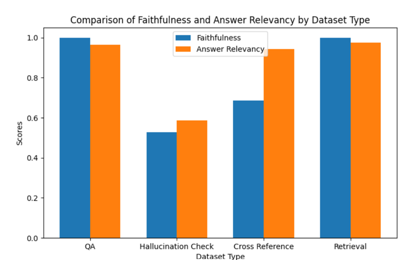
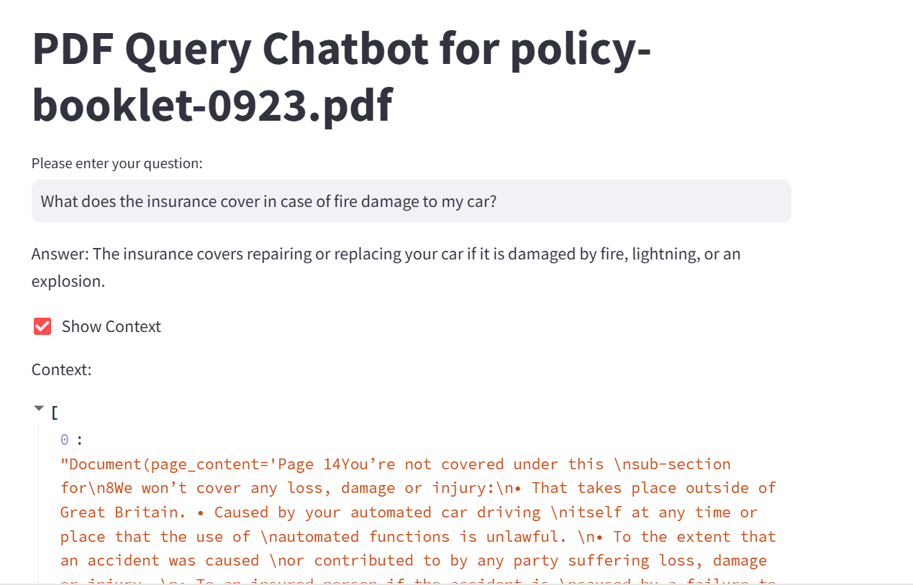

# Rag system to chat with pdfs

## Dataset Generation
We have used ChatGpt-4o to generate a synthetic data based on a given pdf. The prompts used for generating the dataset are stored in dir `dataset_generation_helper`.

TODO: To look into llamaindex/langchain dataset generation API and check if I can use custom prompts within their methods. Current dataset generation was done manually so this can be automated for scaling.

### Dataset Sample
Below is a sample row from the dataset used in the RAG system:

| Question                                                        | answer                                                        | topic          | dataset Type |
|-----------------------------------------------------------------|---------------------------------------------------------------|----------------|--------------|
| What does the insurance cover in case of fire damage to my car? | Fire damage to your car is covered under the main policy.     | Fire and Theft | qa           |

### Dataset Column Explanation
The dataset consists of the following columns:

- **Question**: This column contains the questions to be posed to the language model. These questions are crafted based on specific topics or scenarios.

- **Answer**: This column includes the answers corresponding to the questions. These answers are used to train the model on accurate information retrieval.

- **Topic**: The topic column indicates the subject area under which the question and answer fall, helping to contextualize the conversation.

- **question/dataset Type**: This column classifies the types of scenarios tested in the dataset. Each type is crucial for assing how model handles different kinds of user queries effectively. The types include:

  - **qa**: Simple question-answering scenario where the answer can be directly pulled from one section or topic.
  - **hallucination_check**: Challenges the model with questions that cannot be answered based on the given context. The model should identify the lack of context and inform the user accordingly, rather than fabricating an answer.
  - **cross_reference/multi-chunk**: Scenarios where the answer may need to be inferred from different sections or topics.
  - **retrieval**: Focuses on queries about references, where the user asks under which topic or section they can find specific content. This type specifically tests if the modelcan retrive correct topic for a given user question

Each type can help us find the lacking points of our RAG system. The dataset is saved as csv as **dataset.csv** in the root level of the repo.

### Future work for dataset generation
There are other question types we can consider to make our test dataset more robust like 
- reasoning tasks
- Synthesing questiong regarding specific places, entities and etc.
- Questions that requires reading content from tables should be added **Very important**

## Evaluation metrics

For the purpose of evaluation of responses from our RAG pipeline, we will use RAGAS, an open source python library to evaluate LLM responses. 

RAGAS work on the principle that a smart LLM can find the shortings of another LLM. In our RAG pipeline we are using **ChatGpt-3.5** while RAGAS will be using **ChatGpt-4** for computing the metrics for checking response quality.

Below are the metrics we will use:
- answer_relevancy: How relevant the generated answer is to the user question. Scale [0, 1]. The metric compares generated answer and the user question.

- faithfulness: This metric gives us an idea about the hallucination of the model. It checks the factual consistency of the answer against the retrieved context.

- Note: Context recall and context precision are also important metrics we can compute using RAGAS but due to credit and rate limit, I did not benchmark these metrics.

### Baseline model
- First, I created a simple RAG pipeline using Langchain, Chatgpt 3.5, RecursiveCharacterTextSplitter and OpenAIEmbeddings. The idea here is to get a sense of how our RAG pipeline performs with default setting.

- As we evaluate accuracy with the basleine model, we can identify where we are lacking and improve iteratievly.

Default parameters that can be optimized based on evaluation metrics:
Chunk_size = 1024 tokens
Chunk_overlap = 100 tokens
Text splitter = RecursiveCharacterTextSplitter
embeddings = OpenAIEmbeddings
Vector database = Document
System prompt for LLM = Provided in baseline_rag_pipeline.py

#### Baseline Performance

| Metric             | Value  |
|--------------------|--------|
| Faithfulness       | 0.8427 |
| Answer Relevancy   | 0.8743 |
| Number of Questions| 35     |

A detailed report with each of these per question is provided at: [Download baseline results](report/baseline_result.csv)
. In the above tables we have just taken a mean of the metric across all the questions.

To reproduce the results run **baseline_rag_pipeline.py**. Make sure to put your OpanAI key.

Here is the metrics segmented by dataset/question type

**Performance observations**
1. Simple recalling question which does not require cross-reference are easy to answer based on 'qa' dataset type.
2. Hallucination seems to be big issue. Asking LLM to provide references for its can may improve the results.
3. The system fails at fetching answers that neeeds LLM to look at tabular data.

I also observe that metrics are not very stable or have significant biases how it evaluates the LLM response.

**Metric observation**
1. For example, in  row 12 in baseline_result.csv, we have the following ground truth and generated answer:
Question: Does the policy provide coverage for pets injured in a car accident?

  Ground truth: Based on the provided context, the policy does not explicitly mention coverage for pets injured in a car accident. The focus of the policy appears to be on personal benefits, medical expenses, personal accident coverage for individuals involved in a car accident, and coverage for damage to the car itself. If coverage for pets is desired, it would be advisable to check with the insurance provider or review the policy in detail for any specific provisions related to pets.

  Generated answer: The document does not specify coverage for pets injured in car accidents.

  Faithfullnes = 0, Answer relvance = 0

  This is certainly wrong evaluation as the generated answer clearly answers the question correctly. We can find the similar behaviour in row 13.

2. In row 14 and 15, the RAGAS produced null under Faithfulness, maybe a bug?

3. In row 18, the generated answer is correct but faithfulness shows up to be 0.5 which is unreasonable.

4. In row 21, I find that the ground truth is also incorrect. Maybe ChatGpt failed at reading this document.

Based on the shortcomings of the metrics and dataset generation, it would be strongly recomended that the evaluation dataset be quality checked extensively. 

## Improving Pefroamcne
This is future work based on availability of time and openAI credits.
1. Detection of tablur data and finding a better way to parse this information such that it can be easily used in context by the LLM. This will improve performance where LLM needs to look at table for specific values.
2. Run a random search (or any hyperparameter-tuning algorithm) to find the optimal parameters of our pipeline like chunk_size, text_splitter, embeddings and etc.
3. The generated dataset is of not the best quality due to ChatGpt generation with much human intervention. 

## ChatBot using streamlit application

A simple chatbot has been implemented using streamlit. The app does not support multi-dialogue  and can only answer and dispalce one pair of question, answer.

We can also see the context fetched for each question.

To run the chatbot, ensure you update your **OpenAI key** in **app.py** and run
`
streamlit run app.py
`

